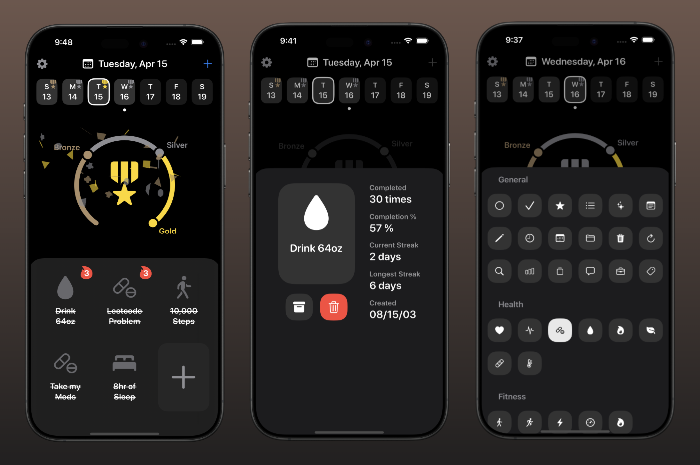

# 🏆 TrophyHabit – Gamified Habit Tracker for iOS

## 📱 Overview

TrophyHabit is an iOS application developed in Swift, designed to help users build and maintain positive habits through gamification. By earning trophies for completing habits, users stay motivated and engaged in their personal development journey.  

## 🖼️ Screenshot




## 🎯 Project Objectives

- Develop a habit-tracking app that incorporates gamification elements.
- Implement a user-friendly interface for creating and managing habits.
- Utilize Swift and SwiftUI to build a responsive and interactive application.

## 🛠️ Technologies Used

- **Programming Language:** Swift
- **Framework:** SwiftUI
- **Platform:** iOS
- **Development Environment:** Xcode

## 🧠 Key Learnings

- **State Management:** Gained experience in managing state within SwiftUI applications.
- **Data Persistence:** Implemented local data storage to save user habits and progress.
- **User Interface Design:** Designed intuitive UI components that enhance user engagement.
- **Gamification Techniques:** Learned how to apply game design elements to encourage habit formation.

## 🚀 Getting Started

1. **Clone the repository:**

    ```bash
    git clone https://github.com/landonwest815/TrophyHabit.git
    ```

2. **Open in Xcode:**
    - Navigate to `File` > `Open` and select the cloned repository folder.

3. **Build and Run:**
    - Select your target device or simulator.
    - Click the `Run` button to build and launch the application.

## 📌 Future Enhancements

- Integrate cloud synchronization to back up user data.
- Add customizable habit categories and reminders.
- Implement analytics to provide users with insights into their habit-building progress.
